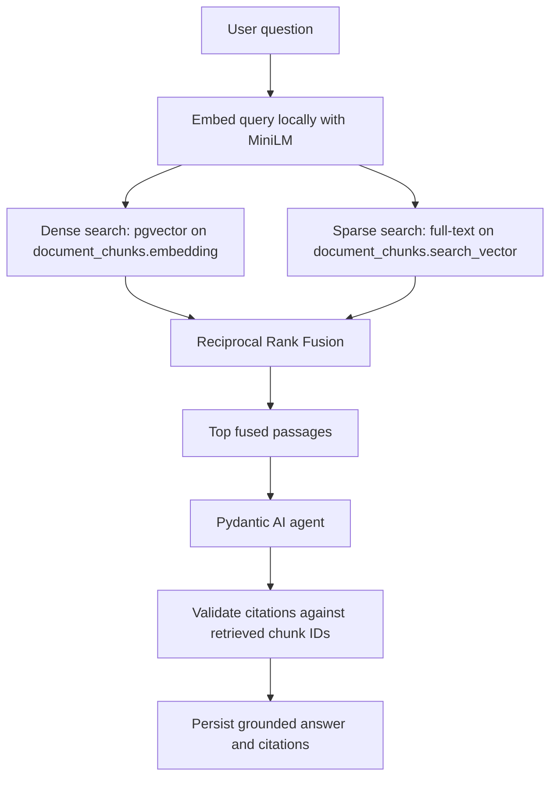

# Retrieval

This folder holds the hybrid retrieval layer for the backend.

## Default settings

- `top_k = 8`
  - number of final passages returned after fusion
- `dense_k = 20`
  - number of pgvector semantic matches fetched before fusion
- `sparse_k = 20`
  - number of Postgres full-text matches fetched before fusion
- `k = 60`
  - Reciprocal Rank Fusion constant used to blend the two ranked lists
- `local_embedding_model = sentence-transformers/all-MiniLM-L6-v2`
  - default embedding model used for query vectors
- `local_embedding_dimensions = 384`
  - output size used for the query embedding vector
- `gemini_chat_model = google-gla:gemini-2.5-flash`
  - default chat model placeholder for the Pydantic AI agent scaffold

## Pipeline overview

1. A user question enters the retrieval route or agent.
2. The original question is embedded locally with MiniLM.
3. A local query processor extracts up to five lexical terms for sparse search.
4. The dense path searches `document_chunks.embedding` with pgvector.
5. The sparse path searches `document_chunks.search_vector` with a relaxed `OR` query.
6. Both ranked lists are fused with Reciprocal Rank Fusion.
7. The top fused passages are returned to the caller or passed to the answer model.

The original question is intentionally kept for semantic retrieval. For PostgreSQL, terms such as `what`, `was`, and `in` add little value and an unmodified natural-language query would require every remaining term to appear in one chunk. The query processor removes question scaffolding, keeps years, company names, financial terms, and identifiers, and joins the selected terms with `OR`.

## Grounding and citations

Retrieval is evidence selection; grounding is the enforcement layer around answer generation. The answer agent should receive the fused passages as its only factual evidence and should return a typed answer plus citation references.

The intended flow is:

1. Authenticate the user and resolve the requested chat thread.
2. Retrieve ranked chunks with dense search, full-text search, and RRF.
3. Give the selected chunks to the Pydantic AI agent through typed dependencies or a retrieval tool.
4. Require the agent to attach a citation to each material factual claim.
5. Validate every citation against the retrieved chunk IDs and metadata.
6. Reject or replace an answer when a citation points to an unavailable chunk or the answer contains unsupported claims.
7. Persist the assistant message and validated `message_citations` rows together.

Grounding is therefore a closed-world contract: if the retrieved passages do not support the question, the assistant should say that there is not enough evidence instead of filling the gap from general model knowledge. Citation metadata should include the source document, accession number, filing date, section, page, and chunk ID so the UI can take the user back to the exact passage.

The retrieval layer should not silently invent citations, and the answer model should not be trusted merely because it produced valid JSON. Validation must check that each cited chunk was actually returned by retrieval for that turn.

## Why this shape

- Dense search is better for semantic similarity and paraphrases.
- Sparse search is better for exact terms, identifiers, and legal or technical phrases.
- RRF keeps the merge simple and robust because the two score systems are not comparable.
- Pydantic AI gives us a clean place to turn retrieval into a tool-driven, typed workflow later.

## Mermaid

## Main files

- `queries.py`
  - dense and sparse search queries
- `fusion.py`
  - Reciprocal Rank Fusion helper
- `retriever.py`
  - end-to-end query, search, fuse flow
- `schemas.py`
  - request and response models
